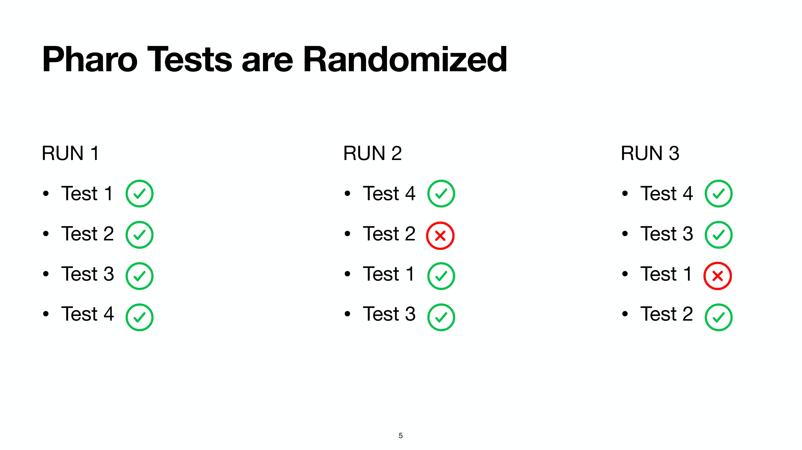
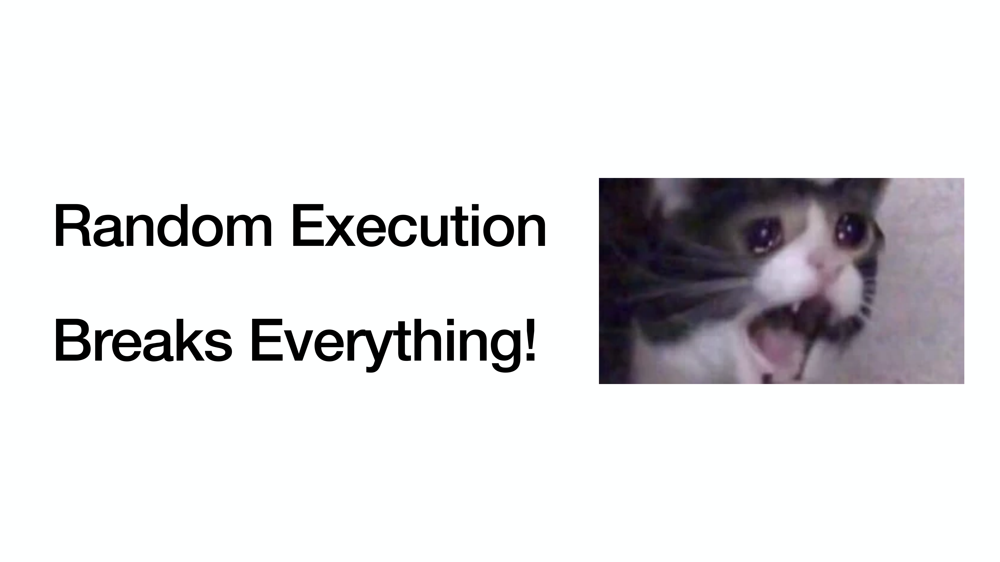
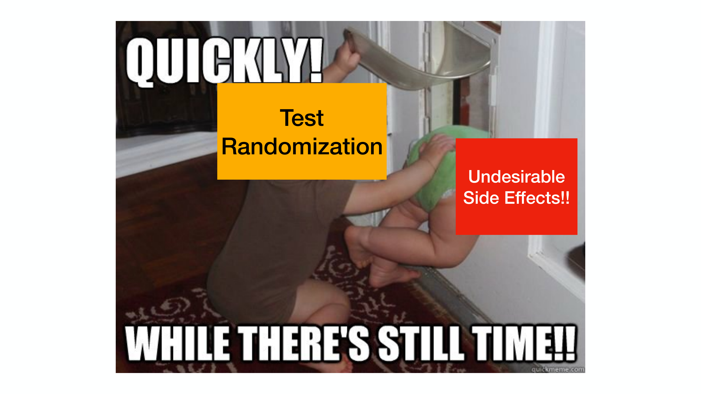
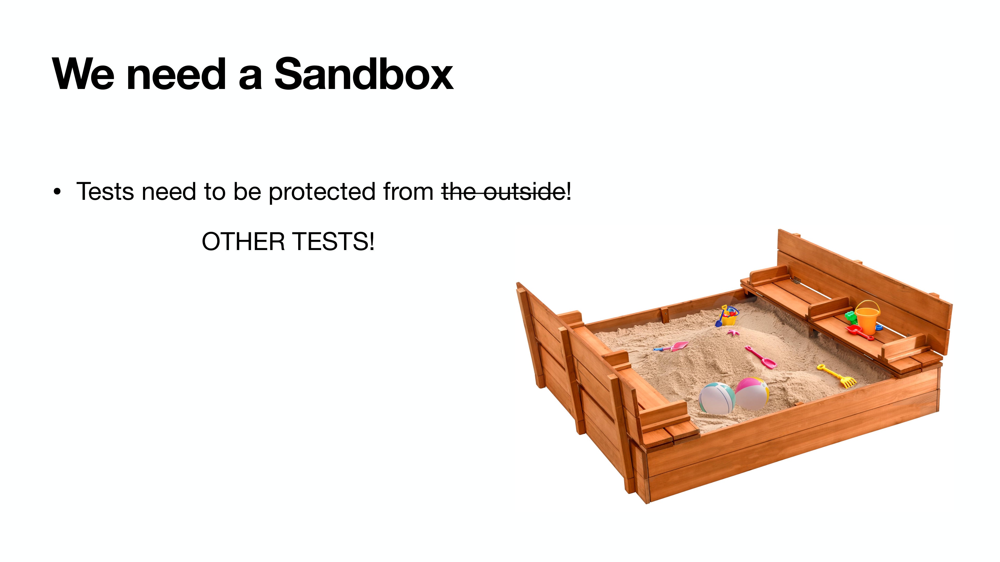
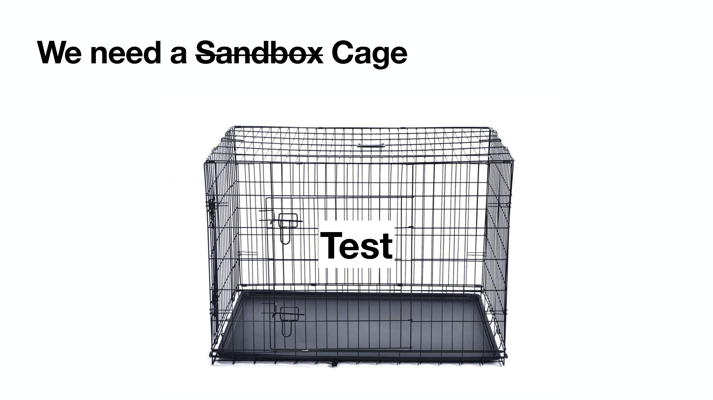
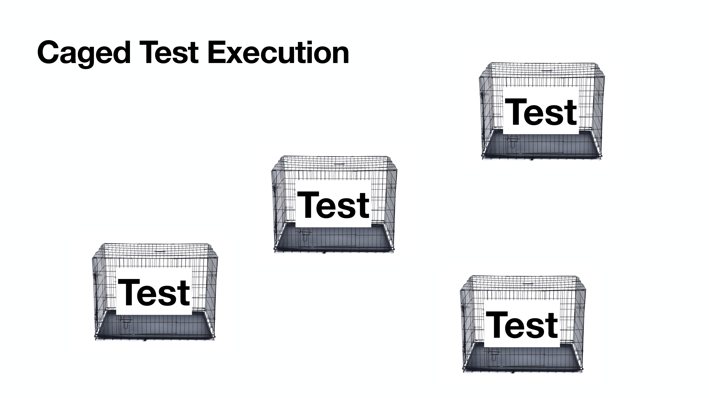
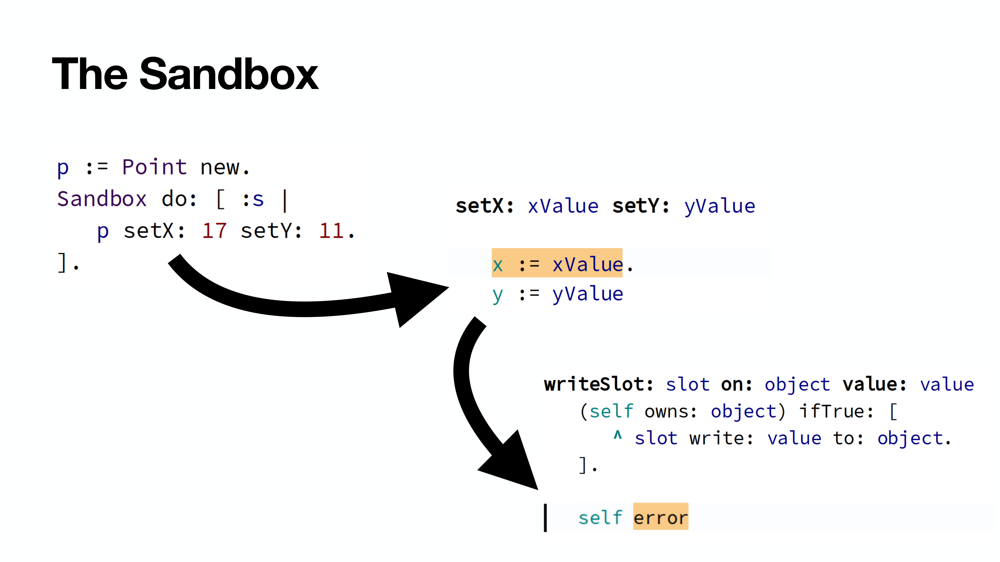
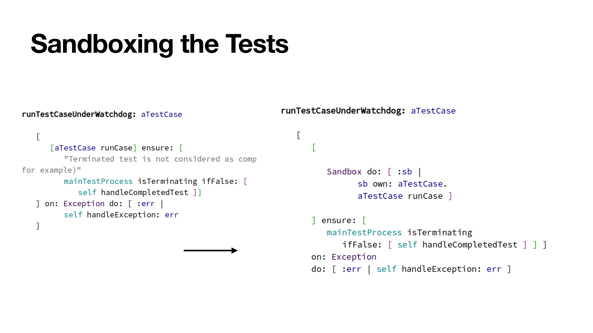
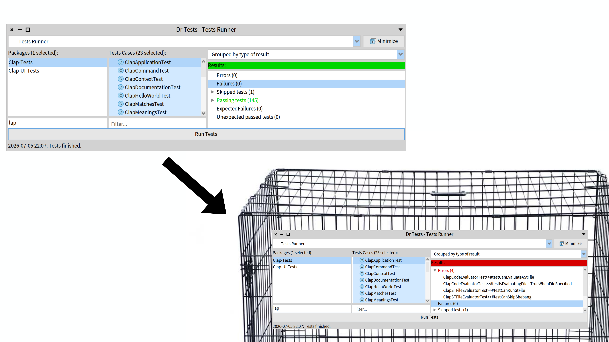

# I Put My Tests in a Sandbox. They Stopped Biting.

Ever had a test suite that fails only when your boss is watching? Or when the stars align with on Cassiopea?
Welcome to flaky tests.

In this post, that is inspired by my ESUG'26 lightning talk about sandboxing.
I'll talk about flakyness. And bad tests. And side effects. And cages.
TLDR; if you cage your tests, they'll stop biting.

## Random order, random pain

In the Pharo CI, it turns out that some of these flaky failures happen because Pharo deliberately randomizes test execution.
For example, in the picture below, there are some test orders that are all green, while other test orders will make one or more tests fail.



You may say, oh, test randomization is then bad!!!
Test randomization is a super cool feature used in many testing frameworks: it exposes hidden dependencies instead of letting them sleep under the carpet.



The problem with test randomization is that it is not so easy to debug.
Indeed the test that breaks is not the bad test, it's a test that has been victim of a bad test.
Which one(s) of the previously run tests is (are) the bad test?
You will need to reproduce the issue, reduce the test suite to the minimal test suite doing it, then manually debug finding what is the impact of the previous tests on the breaking one.

Is that the way to go?
The point is that some test, somewhere, at some point in time, is polluting your environment: changing a file, touching a global variable, creating garbage objects and producing extra GCs...
And then there is another test, potentially healthy, expecting a clean environment, that does break because your environment was not clean.
This means test randomization is just hiding somebody else: undesired side effects.



## The Vision: Don't break my toys, I'll not break yours

Tests should be able to execute in a safe and healthy environment where they can develop and grow unharmed.
That is typically called a sandbox.



However, turns out it all gets complicated when tests start sharing toys.
A test should not break other test('s toys).
Test should be able to share their toys (global state) but not break them, because they are everybody's.
And if a test A breaks the toy of another test B, then test A should be taught better.
And ideally, we should prevent such problem before it happens.

So this is the vision:

> Don't break my toys, I'll not break yours.

But for that, we could rely on good practices and discipline.
Or, we could turn the sandbox into a cage.
Tests should not escape from the cage and break other's stuff.



And if we had that, we could think about caged test execution, where each test runs in its own space.
If a test tries to bite another test (i.e., it has a side effect outside of its cage), then that test should be put aside.



Eventually, tests that are well-behaved will be adopted by loving and caring families.

## The sandbox cage 🦜

So I implemented this idea. I called it *the sandbox*. Historical reasons.
How does it work?

**Rule 1.** Code that executes in the sandbox can only affect objects created inside of the sandbox.

```smalltalk
Sandbox do: [ :s |
    p := Point new.
    p setX: 17 setY: 11.
].
>>> 17@11
```

**Rule 2.** Code that executes on the sandbox will fail with an exception if it affects an object created outside of the sandbox.

```smalltalk
p := Point new.
Sandbox do: [ :s |
    p setX: 17 setY: 11.
].
```



## The sandbox in motion

Now that it was working, I was able to patch SUnit to do *caged test execution*!!



And find out that the tests in Pharo are less healthy than they should.
This immediately reveals (test) design smells:
- hidden singleton writes
- regexes with surprising side effects
- UI progress bars touched by libraries
- creative exception handling



## How is it implemented?

I hacked around an ugly prototype in a couple of hours.
The idea: the sandbox *owns* the objects created inside it, and allows only writes on them.

**First:** I needed to capture allocations and make the sandbox own it.
Thus, I rewrote `basicNew` to something like the following:

```smalltalk
Behavior >> basicNew [

	CurrentSandbox ifNil: [ ^ self doBasicNew ].
	^ CurrentSandbox allocateClass: self
]

Behavior >> doBasicNew [
	<primitive: 70 error: ec>
	...
]

Sandbox >> allocateClass [
	| newInstance |
	newInstance := aClass doBasicNew.
	self own: newInstance.
	^ newInstance
]
```

**Second:** I needed to capture all writes, and allow them if the sandbox allows.
So I rewrote how instance variable writes were compiled on the `InstanceVariableSlot`:

```smalltalk
InstanceVariableSlot >> emitStore: methodBuilder [
	"generate store bytecode.
	Does not pop the stored value!"
	
	| tempName |

	"The original code was:
	methodBuilder storeInstVar: index.
	"
	
	"CurrentSandbox == nil"
	methodBuilder pushLiteralVariable: (Smalltalk globals bindingOf: #CurrentSandbox).

	"== nil if false"
	methodBuilder pushLiteral: nil.
	methodBuilder send: #==.
	methodBuilder jumpAheadTo: #sandboxed if: false.

	"no sandbox, do the store and continue"
	methodBuilder storeInstVar: index.
	methodBuilder jumpAheadTo: #continue.
	
	"sandbox!"
	methodBuilder jumpAheadTarget: #nonDefaultDomain.
	
	"Write
		thisSlot := valueToStore.
	
	to the equivaltent sandboxed:
	
		value := stack_top.
		CurrentSandbox writeSlot: thisSlot on: currentReceiver value: valueToStore (top of stack)"

	"Store the top of the stack in a temp"
	tempName := '0slotTempForWriteDomain'.
	methodBuilder
		addTemp: tempName;
		storeTemp: tempName.

	"Then send to the sandbox"
	methodBuilder pushLiteralVariable: (Smalltalk globals bindingOf: #CurrentSandbox).
	methodBuilder pushLiteral: self.
	methodBuilder pushReceiver.
	methodBuilder pushTemp: tempName.
	methodBuilder send: #writeSlot:on:value:.
	methodBuilder popTop.

	methodBuilder jumpAheadTarget: #continue
]

Sandbox >> writeSlot: aSlot on: currentReceiver value: valueToStore [
	(self owns: object) ifTrue: [
		^ slot write: value to: object.
	].
	
	"Nope!"
	self error: 'Undesired side effect!'
]
```

Now you can recompile the image and go on.
I let to you the reader completing the missing code ;).
You're gonna need to activate the sandbox, cover other allocation primitives, other kind of side effects...

But this works!

Pretty well actually!

## Final thoughts

Now, using this in practice presents some design questions we should explore further:

- Should creating symbols pollute the symbol table? (`aSymbol , aString`)
- Should a delay affect the scheduler?
- What about finalization?
- What exactly counts as I/O?
- FFI? Network? Files? Primitives?

Turns out "just isolate the tests" is only four words. Making it production ready is... slightly longer.

Also, the sandbox isn't for free—it is a tad slower—but I'm sure we can optimize it.
And the architecture, that actually comes from [Stefan Marr's PhD thesis](https://kar.kent.ac.uk/63836/), opens doors to transactional execution, better debugging, and cleaner software architecture.
So maybe it's worth looking at it!

Happy testing! 🧪
